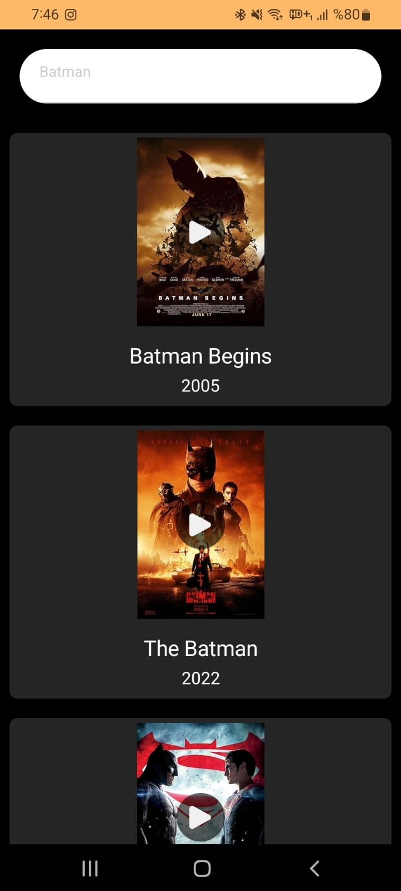

## Compose Movie App 🎬
Compose Movie App is an Android application that fetches and displays movies from the [OMDb API](http://www.omdbapi.com/). 
Users can browse a list of movies, view detailed information about each movie, and search for specific films. The app is built using Jetpack Compose and follows the MVVM architecture pattern.

## Features 🚀
- Movie Listing: Browse a list of movies fetched from the OMDb API.
- Movie Details: View detailed information about selected movies.
- Search Functionality: Search for specific movies by title.
- MVVM Architecture: Ensures a clear separation between the UI and business logic.

## Screenshots 📱
Below are some screenshots of the app:
<p align="center">
  
  
</p>

## Technologies and Libraries Used 🛠
- Jetpack Compose: For building a declarative and modern UI.
- Retrofit: For making API requests to fetch movie data.
- OkHttp: For handling HTTP requests and logging.
- Coroutine Flow: For managing asynchronous data streams.
- Coil: For loading movie posters and images.
- Dagger Hilt: For dependency injection.
- Compose Navigation: For handling navigation between screens.

## Architecture Details 🛠️
- MVVM Architecture:
  <br>
1- ViewModel: Handles UI state and manages interaction with the repository using Coroutine Flow.
  <br>
2- Repository: Fetches data from the OMDb API and provides it to the ViewModel.


- Dependency Injection: Managed with Dagger Hilt for clean and scalable code.
- Navigation: Handled using Compose Navigation for smooth transitions between screens.

## Setup and Run
1- Clone the repository:
```bash
git clone https://github.com/your-username/compose-movie-app.git
```
Add your OMDb API key:
- Sign up for an API key at [OMDb API](http://www.omdbapi.com/).
- Put the api key in the Constants.kt file in the project.
```kotlin
object Constants {
    const val API_KEY = "YOUR_API_KEY"
}
```
3- Open the project in Android Studio and run it on your device/emulator.

## Contributing
- Forking the repository.
- Working on a new feature or bug fix.
- Submitting a pull request.
